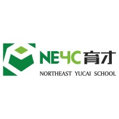
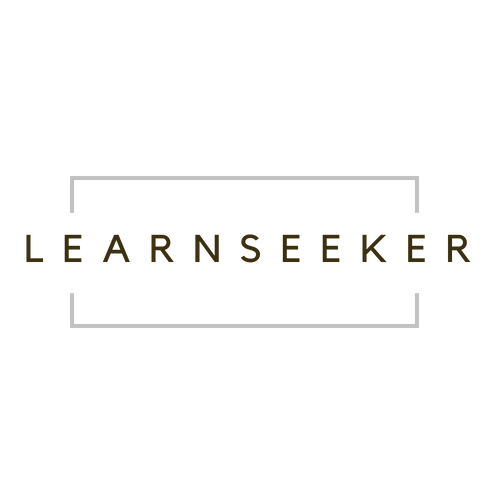
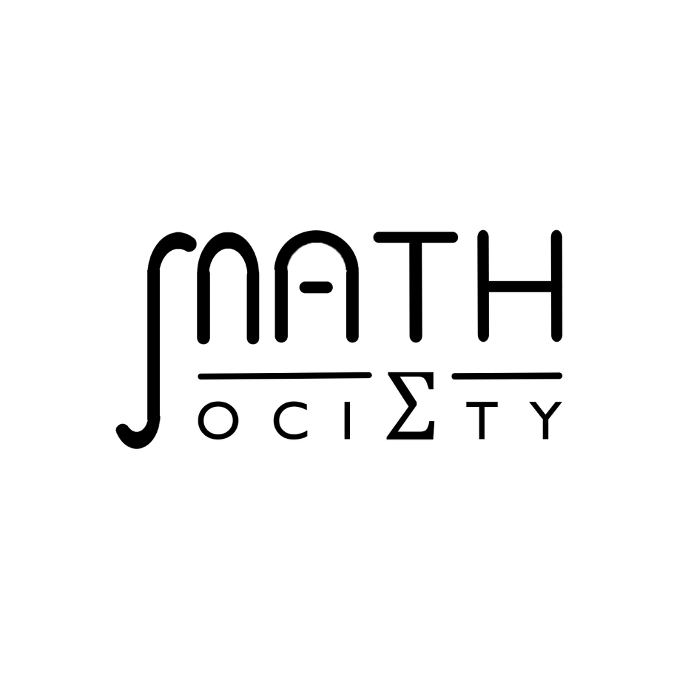

# About Me
{: .fs-9 }

Tian Xiao *@snoidetx*
{: .fs-6 .fw-300 }

[View LinkedIn Profile](https://www.linkedin.com/in/tian-xiao-1202){: .btn .btn-purple}

---

Here is the portfolio page of Tian Xiao (*@snoidetx*). Feel free to contact him at:
* Email (Personal): tianxiaos1202@gmail.com
* Email (School): tianxiao02@u.nus.edu
* Phone: (65) 8510 6059
* GitHub: @snoidetx
* Instagram: @snoidetx
* Telegram: @snoidetx
* WeChat: @tianxiao_1202

**Note: The former *snoidetx.github.io* has been depreciated. All its contents are migrated to this site.**

## Education

|  | National University of Singapore |
| :-: | --- |
|  | **Bachelor of Science & Bachelor of Computing** Singapore · Aug 2020 - Present Full-time · Ongoing  • Applied Mathematics and Computer Science (Double Degree) • Expected Date of Graduation: May 2024 • CAP (Applied Mathematics): 4.93/5.00 • CAP (Computer Science): 4.91/5.00  **Awards and Honours**  • Science & Technology Undergraduate Merit Scholarship • Dean's List, Bachelor of Computing, AY2021/22 Semester 1 • Dean's List, Bachelor of Science, AY2021/22 Semester 1 • Cohort Top among 634 students, CS1010S Programming Methodology, AY2020/21 Semester 1 • Cohort Top among 435 students, CS1231 Discrete Structures, AY2020/21 Semester 1  **Relative Modules Taken**  Artificial Intelligence · Calculus · Combinatorics and Graphs · Computer Organisation · Data Structure and Algorithms · Design and Analysis of Algorithms · Discrete Structures · Linear Algebra · Machine Learning · Mathematical Analysis · Numerical Analysis · Operating Systems · Probability · Programming Methodology · Regression Analysis · Software Engineering   | 
|  | **Ridge View Residential College Programme** Singapore · Aug 2020 - May 2022 Full-time · 1 yr 10 mos  • Led Project GreenFood@NUS in Action For Sustainability Symposium and achieved Best Project - Influencer Award. • Completed RVRC Year One & Two Programme. |
{: .table-about }

|  | National Junior College |
| :-: | --- |
|  | **Singapore Cambridge GCE A-Level Certificate** Singapore · Jan 2018 - Dec 2019 Full-time · 2 yrs  **Awards and Honours**  • Ministry of Education School-based Scholarship (SM1)  **Relative Modules Taken**  H2 Economics · H2 Further Mathematics · H2 Mathematics · H2 Physics |
{: .table-about}

|  | Catholic High School |
| :-: | --- |
|  | **Singapore Cambridge GCE O-Level Certificate** Singapore · Jan 2016 - Dec 2017 Full-time · 2 yrs  **Awards and Honours**  • Ministry of Education School-based Scholarship (SM1)  **Relative Modules Taken**  Additional Mathematics · Biology · Chemistry · Mathematics · Physics |
{: .table-about }

|  | Northeast Yucai School |
| :-: | --- |
|  | **NEYC Junior High School Programme** China · Sep 2011 - Oct 2015 Full-time · 4 yrs 2 mos |
{: .table-about }

 

## Work and Internship Experiences

|  | Singtel |
| :-: | --- |
|  | **Software Developer** May 2022 - Present Internship · Ongoing  • Developed cross-platform mobile applications as part of the mobile chapter. |
{: .table-about }

|  | National University of Singapore |
| :-: | --- |
|  | **Teaching Assistant (CS2030/S)** Jan 2022 - Present Part-time · Ongoing  • Assisted professors in preparing and facilitating teaching of module CS2030 Programming Methodology II, a course to introduce fundamental programming methodology such as code design and coding style using Java involving more than 200 students. • Supervised weekly laboratory sessions for students to get hands-on experience on applying certain methodologies and principles, reviewed their assignment submissions and gave feedbacks.   | 
|  | **Teaching Assistant (CS2040/S)** Aug 2021 - Present Part-time · Ongoing  • Assisted professors in preparing and facilitating teaching of module CS2040/S Data Structures and Algorithms, a course to equip students with knowledge on basic data structures and algorithms in computing using Java involving more than 450 students. • Developed class materials and conducted weekly laboratory sessions for students to reinforce conceptual knowledge and get hands-on experience on using certain data structures and algorithms and marked their assignments. |
{: .table-about }

|  | Learnseeker |
| :-: | --- |
|  | **Education Strategist & Creator** Oct 2021 - Jan 2022 Internship · 4 mos  • Facilitated the operation of LearnSeeker, an AI data visualisation and automatic grading tool for schools. • Created digital education resources. • Managed the classification and curation of education resources. |
{: .table-about }

|  | Agency for Science, Technology and Research |
| :-: | --- |
|  | **Researcher** Mar 2018 - Feb 2019 Internship · 1 yr  • Conducted research on possibilities of using Lock-in Thermography Technique to detect 3-dimensional geometries of an object and evaluated its practicability of being applied to real life scenarios. • Computed Python algorithms (regression analysis & machine learning) to determine correlations within large datasets retrieved from Lock-in Thermography Technique. • Collaborated with colleagues to predict general trends beyond pre-engineered prototypes. |
{: .table-about }

 

## Co-curricular Activities (CCAs) and Community Services

|  | NUS Mathematics Society |
| :-: | --- |
|  | **Publicity Director** Mar 2021 - Jun 2022 Part-time · 1 yr 2 mos  • Managed all publicity matters of NUS Mathematics Society to increase its uptake and improve its impact in order to benefit student community. • Publicised NUS Mathematics Society in Orientation Camp and Student Life Fair via multiple social media platforms that recruited and retained around 120 members in total. • Bridged communication on career information between around 1500 students, school departments and companies. |
{: .table-about }

|  | NUS Teach Singapore |
| :-: | --- |
|  | **Academic Coach** Aug 2021 - December 2021 CCA · 5 mos  • Provided academic coaching and mentoring to children and teenagers under Christ Church Secondary School Champions Youth Tuition Programme, as a member of NUS Teach Singapore initiative. |
{: .table-about }

|  | Kebun Baru Community Centre Peer Mentorship Programme |
| :-: | --- |
|  | **Chairperson** Nov 2018 - Aug 2019 Volunteer · 10 mos  • Organised and chaired Peer Mentorship Programme to tutor disadvantaged children at Kebun Baru Community Centre. • Conducted mentoring sessions and facilitated talent development workshops for 50 children. • Arranged schedules of 22 members to ensure sufficient manpower. |
{: .table-about }

|  | NJC Chinese Orchestra and Guzheng Ensemble |
| :-: | --- |
|  | **Section Leader** June 2018 - June 2019 CCA · 10 mos  • Headed Bowed Strings Section in Chinese Orchestra and facilitated major events as part of the Execution Committee. • Cooperated with conductors and other sections to achieve perfect coordination across orchestra and obtained a Certification of Distinction at Singapore Youth Festival 2019 Arts Presentation For Chinese Orchestra (Full Orchestra) - Junior College. • Organised activities and outings to promote camaraderie within whole orchestra involving about 100 members. |
{: .table-about }

|  | Citi-YMCA Youth for Causes: Project EOS |
| :-: | --- |
|  | **Chairperson** Feb 2018 - Oct 2018 Volunteer · 9 mos  • Initiated and chaired Project EOS to raise funds and public awareness for underprivileged children in Singapore. • Partnered with Singapore Children’s Society for starting funds and necessary help in order to improve credibility and authority. • Communicated with members for creative marketing strategies and raised thousands of Singapore Dollars for underprivileged children. |
{: .table-about }

|  | CHS Chinese Drama |
| :-: | --- |
|  | **Student Director** Jan 2016 - June 2017 CCA · 1 yr 6 mos  • Directed drama shows and supervised script-writing, trainings and performances. • Consulted with Director, actors and 5 assisting units and was awarded a Certification of Distinction at Singapore Youth Festival 2017 Arts Presentation For Chinese Orchestra (Full Orchestra) - Secondary School. |
{: .table-about }

 

## Additional Information

|  | Skills and Interests |
| :-: | --- |
|  | **Languages**  • English (Bilingual or Native) • Mandarin (Bilingual or Native) |
|  | **IT Skillsets**  • Programming Languages (Bash, C, CSS, HTML, Java, JavaScript (with React, React Native and Redux), Kotlin, MATLAB, Python, R, TypeScript) • Revision Control Softwares (Git (with BitBucket and Github platforms)) • Machine Learning Libraries (Keras, SkyLearn) • Operating Systems (MacOS, Linux, Windows) • Productive Softwares (Adobe Photoshop, Adobe Audition, Studio One) |
|  | **Interests**  • Basketball • Music • Fine Arts |
{: .table-about#table-about-without-timeline }
