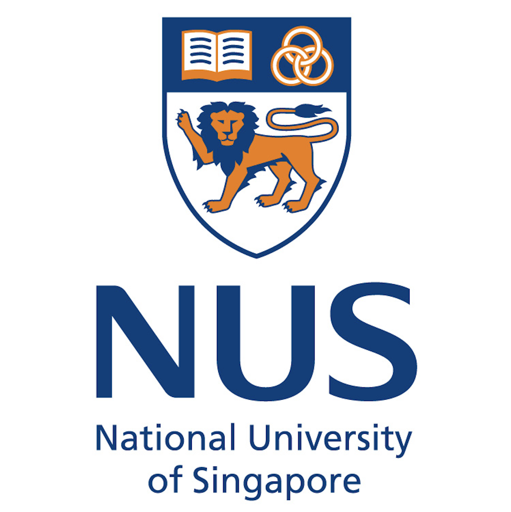
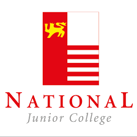

# Education
{: .fs-9 }

From China to Singapore.
{: .fs-6 .fw-300 }

[View Transcripts](./transcript){: .btn-whole}

---

The **Education** section and its subsections mainly contain information about my experience at **National University of Singapore** (NUS), including my **transcript**, **exchange experience**, etc. A complete timeline of my education background is given below. You may also see [here](./education-bio) for a description written in text. 

|  | National University of Singapore |
| :-: | --- |
|  | **Ph.D. in Computer Science** Jan 2025 - Present  Full-time · Ongoing  • GPA: 5.00/5.00  **Awards and Honours**  • A*STAR Computing and Information Science Scholarship holder  **Relevant Courses Taken**  Advanced Topics in Artificial Intelligence · Advanced Topics in Natural Language Processing · AI Planning and Decision Making · Algorithmic Mechanism Design · The Algorithm Designer's Toolkit   |
|  | **Bachelor of Science & Bachelor of Computing** Singapore · Aug 2020 - Dec 2024 Full-time · 4 yrs 5 mos  • Applied Mathematics and Computer Science (Double Degree) • GPA (Applied Mathematics): 4.95/5.00 • GPA (Computer Science): 4.91/5.00  **Awards and Honours**  • NUS Science & Technology Undergraduate Merit Scholarship • Turing Programme candidate • Outstanding Undergraduate Researcher (OUR) Prize (Best Undegraduate Researcher (Individual)) • Certificate of Distinction in the Algorithms & Theory focus area • Certificate of Distinction in the Artificial Intelligence focus area • 6x Dean's list • 1st out of 634 students, CS1010S Programming Methodology (AY2020/21 Semester 1) • 1st out of 435 students, CS1231 Discrete Structures (AY2020/21 Semester 1) • 1st out of 214 students, CS3244 Machine Learning (AY2021/22 Semester 2) • 6th out of 381 students, CS3230 Design and Analysis of Algorithms (AY2021/22 Semester 2) • 1st out of 24 students, CS2309 Research Methodology (AY2022/23 Semester 1) • 1st out of 48 students, CS5234 Algorithms at Scale (AY2024/25 Semester 1) • SoC Take on the World Award (SToW) awardee • Top 9 Finalist, Beyond Health Hack ‘21 • Top 7 Finalist, Tencent Green Game Jam for Youth 2021  **Relevant Courses Taken**  Algorithms at Scale · Artificial Intelligence · Calculus · Combinatorics and Graphs · Computer Organisation · Data Structure and Algorithms · Design and Analysis of Algorithms · Differential Equations · Discrete Optimization · Discrete Structures · Fourier Analysis and Approximation · Game Theory · Information Theory · Linear Algebra · Linear Programming · Machine Learning · Mathematical Analysis · Mathematical Logic · Mathematical Modelling · Non-Linear Programming · Numerical Analysis · Operating Systems · Optimization Algorithms · Probability · Programming Methodology · Regression Analysis · Research Methodology · Set Theory · Software Engineering · Statistics · Uncertainty Modelling  Check out my **[academic plan](https://docs.google.com/spreadsheets/d/1t5A2k4gFv_IYc4teYlm2Lii0fDRE_2yDAPmqYK4nIes/edit?usp=sharing)**!   | 
|  | [**Tokyo Institute of Technology Student Exchange Programme**](./exchange) Japan · Sep 2023 - Feb 2024 Full-time · 6 mos  **Relevant Courses Taken**  Computer Vision · Data Assimilation · Information Processing · Inverse Problems · Statistics · Theory of Algorithms   |
|  | **NUS Mathematics Society, Publicity Director** Mar 2021 - Jun 2022 Part-time · 1 yr 2 mos  • Managed all publicity matters of NUS Mathematics Society to increase its uptake and improve its impact in order to benefit student community. • Designed the current [**NUS Mathematics Society logo**](./img/logos/logo-mathsoc.png). • Publicised NUS Mathematics Society in Orientation Camp and Student Life Fair via multiple social media platforms that recruited and retained around 120 members in total. • Bridged communication on career information between around 1500 students, school departments and companies. |
|  | **Ridge View Residential College Programme** Singapore · Aug 2020 - May 2022 Full-time · 1 yr 10 mos  • Completed RVRC Year One & Two Programme. • Led Project GreenFood@NUS in Action For Sustainability Symposium and achieved Best Project - Influencer Award. |
{: .table-about }

|  | National Junior College |
| :-: | --- |
|  | **Singapore Cambridge GCE A-Level Certificate** Singapore · Jan 2018 - Dec 2019 Full-time · 2 yrs  **Awards and Honours**  • PRC Junior-Middle 3 (SM1) Scholarship holder • Cohort Top in H2 Mathematics • Certificate of Merit, NJC Science Training and Research Programme • Gold Award, Singapore Mathematical Olympiad (Open Section) 2018 • Honour Roll Certificate (Top 5%) & Certificate of Distinction, American Mathematics Competition 12 2018 (Qualified to American Invitational Mathematics Examination) • Silver Award, Singapore Mathematical Olympiad (Open Section) 2019 • Certificate of Distinction & Certificate of Achievement, American Mathematics Competition 2019 (Qualified to American Invitational Mathematics Examination) • 1st Runner-Up, NUS ISE National Business Analytics Case Competition 2019  **Relevant Courses Taken**  H1 General Paper · H1 Project Work · H2 Economics · H2 Further Mathematics · H2 Mathematics · H2 Physics · H3 Science Research |
|  | **NJC Chinese Orchestra and Guzheng Ensemble, Section Leader** Jun 2018 - Jun 2019 CCA · 10 mos  • Headed Bowed Strings Section in Chinese Orchestra and facilitated major events as part of the Execution Committee. • Cooperated with conductors and other sections to achieve perfect coordination across orchestra and obtained a Certification of Distinction at Singapore Youth Festival 2019 Arts Presentation For Chinese Orchestra (Full Orchestra) - Junior College. • Organised activities and outings to promote camaraderie within whole orchestra involving about 100 members. |
{: .table-about}

|  | Catholic High School |
| :-: | --- |
|  | **Singapore Cambridge GCE O-Level Certificate** Singapore · Jan 2016 - Dec 2017 Full-time · 2 yrs  **Awards and Honours**  • PRC Junior-Middle 3 (SM1) Scholarship holder • Catholic High School Tan Kiok Ngiap Memorial Award (Cohort Top in Mathematics, Additional Mathematics and Higher Chinese) • School Representative in National Science Challenge 2016 • Youth Navigator, Outward Bound Singapore 2016 • Gold Award, Singapore Mathematical Olympiad (SMO) (Open Section) 2016 • Gold Award & 26th Individual Prize, SMO (Senior Section) 2016 • High Distinction, UNSW International Competitions and Assessments for Schools (ICAS) (Mathematics) 2016 • Individual Gold, International C. B. Paul Science Quiz 2016 • High Distinction, ICAS (Science) 2016 • Bronze Award, Singapore Junior Physics Olympiad (SJPO) (Main Category) 2016 • Silver Award, SMO (Open Section) 2017 • High Distinction & Medal Winner, ICAS (Mathematics) 2017 • Distinction, ICAS (Science) 2017 • Distinction, Big Science Competition 2017 • Honourable Mention, SJPO (Open Category) 2017 • Certificate of Merit, Singapore Junior Chemistry Olympiad (Open Category) 2017  **Relevant Courses Taken**  Additional Mathematics · Biology · Chemistry · Combined Humanities (Geography & Social Studies) · Mathematics · Physics |
|  | **CHS Chinese Drama, Student Director** Jan 2016 - Jun 2017 CCA · 1 yr 6 mos  • Directed drama shows and supervised script-writing, trainings and performances. • Consulted with Director, actors and 5 assisting units and was awarded a Certification of Distinction at Singapore Youth Festival 2017 Arts Presentation For Chinese Orchestra (Full Orchestra) - Secondary School. |
{: .table-about }

|  | Northeast Yucai School |
| :-: | --- |
|  | **NEYC Junior High School Programme** China · Sep 2011 - Oct 2015 Full-time · 4 yrs 2 mos  **Awards and Honours**  • Awards and honours in junior high school ([view](./neyc-awards)) • 6.5/9.0, IELTS Academic 2015 |
|  | **NEYC Chinese Orchestra, Performer** Sep 2012 - Jun 2015 CCA · 2 yr 10 mos  • Played Erhu and participated in school concerts. • Travelled to Taiwan with the whole orchestra and went through musical exchange with local schools. |
{: .table-about }
